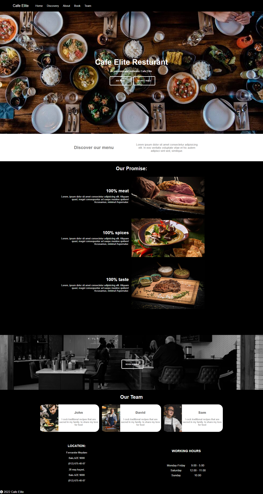

# GITHUB INDICATORS

  # Cafe-Elite-Landing-Page

Hello, welcome to this page. Today I create with html and css file for Cafe-Elite-Landing-Page. I use here html and css tags. 
## ## RULES OF USE

> STEP-1: https://github.com/BakhtiyarM/Cafe-Elite-Landing-Page.git  
> STEP-2:  enter the "Cafe-Elite-Landing-Page" folder that appears  
> STEP-3:  open the folder you are in a text editor  
> STEP-4:  run the  all "index.html" files in the main folder  
> STEP-5:  to download the project as ".zip"  [here](https://github.com/BakhtiyarM/Cafe-Elite-Landing-Page/archive/refs/heads/master.zip) click  

## Technology

This project was developed using the following technologies

| No | Technique | Purpose |
| - | ---------- | --------------------- |
| 1 | HTML | Building a project skeleton |
| 2 | CSS |  Make-up of the established skeleton |
| 3 | GIT |  Project version control management |
| 5 | VSCode | Text editor used in the project |

## SAMPLE SCREEN APPEARANCE

